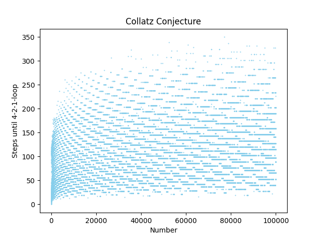

# Collatz Conjecture Simulator

## Overview

This repository contains a simple Python script for simulating the Collatz Conjecture.

The Collatz conjecture is one of the most famous unsolved problems in mathematics. The conjecture asks whether repeating two simple arithmetic operations will eventually transform every positive integer into 1. 

It concerns sequences of integers in which each term is obtained from the previous term as follows: if the previous term is even, the next term is one half of the previous term. If the previous term is odd, the next term is 3 times the previous term plus 1. The conjecture is that these sequences always reach 1, no matter which positive integer is chosen to start the sequence. 

## Results

The generated image (`example.png`) aids in visualizing the number of steps required for a value to ultimately enter the 4-2-1 loop.

