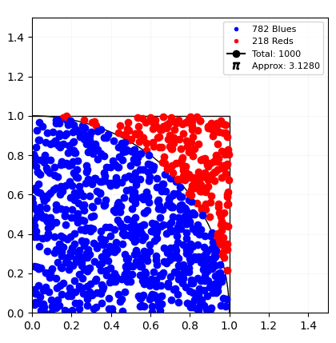

# Approximating PI using Monte Carlo method

## Overview

This project demonstrates the estimation of the mathematical constant PI (π) using the Monte Carlo method. Monte Carlo methods, or Monte Carlo experiments, are a broad class of computational algorithms that rely on repeated random sampling to obtain numerical results. The underlying concept is to use randomness to solve problems that might be deterministic in principle [Wikipedia](https://en.wikipedia.org/wiki/Monte_Carlo_method)
 

## How it works

1. **Generate Random Points**: Randomly generate a large number of points within a square.

2. **Check Point Positions**: Determine whether each point falls inside the quarter circle by calculating the distance from the origin. Points within the quarter circle are considered "hits."

3. **Calculate PI Approximation**: The ratio of points inside the quarter circle to the total number of points generated is used to approximate the value of PI.

4. **Visualize Results**: An image is provided to visually represent the process and the placement of points within the square.

## Usage

To run the program, simply execute the main script:

```bash
python simulation.py
```

Ensure you have Python installed on your machine.

## Dependencies

This project has the following dependencies:

- Python 3.x
- [matplotlib](https://matplotlib.org/) for visualization

Install the dependencies using:

```bash
pip install matplotlib
```

## Results

The result image (`example.png`) showcases the generated points within the square, with hits inside the quarter circle highlighted in blue.

